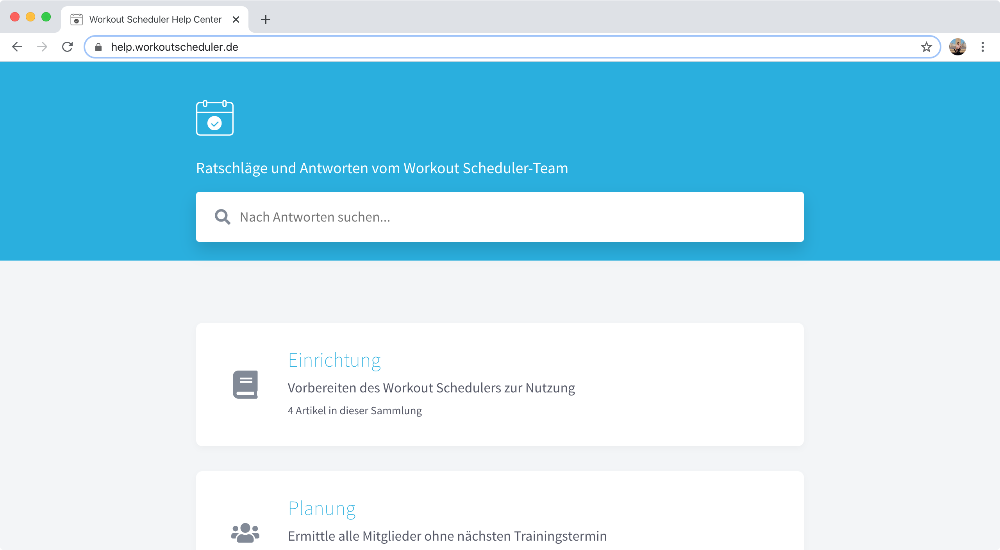

The goal of this project is to enable anyone to set up a free help center for their product. Help Centers are websites which contain documentation, ansers to frequent questions and tips for your product or service. Having a help center reduces the number of support tickets you'll receive. You don't even need to know how to code to set it up. This help center comes with tons of documentation guiding you through the setup and continued use.

 

## A Help Center?

This project allows you to set up a help center for your product. The users of your product can visit the help center to find answers to recurring problems, to learn about advanced features, or even the latest changes. The content is completely up to you.

Typically having a help center greatly reduces the number of support requests you'll get, as your users will find answers to the most common questions in your help center.

Think of a help center as a hybrid of FAQs, pro-tips for power users and a changelog.

## What is this exactly?

I needed a help center for a project I'm working on, but I wasn't happy with the existing solutions. Most of them were paid SaaS-products, which offered way more features than I needed and had a hefty price tag. Instead, I set out to create a help center myself. I later converted it into a [Gatsby Starter](https://www.gatsbyjs.org/docs/starters/) called [`gatsby-starter-help-center`](https://www.github.com/dferber90/gatsby-starter-help-center) and open-sourced it.

You can use [`gatsby-starter-help-center`](https://www.github.com/dferber90/gatsby-starter-help-center) to build your own help center. The remaining documentation shows you how to set it up, edit your content and how to host it for free.

## How to use this project?

You'll need to create a new [Gatsby Starter](https://www.gatsbyjs.org/docs/starters/) based on [`gatsby-starter-help-center`](https://www.github.com/dferber90/gatsby-starter-help-center). Then you'll fill the starter with your own content by creating and editing [Markdown](https://en.wikipedia.org/wiki/Markdown) files. The collections are managed through a [YAML](https://en.wikipedia.org/wiki/YAML) file. Finally you'll need to host the generated static site. There are free solutions like [Netlify](https://www.netlify.com/) for this.

_The full setup instructions are written down in "[Setup](/articles/setup)"._

## What does the help center look like?

The page you're looking at right now is built with [`gatsby-starter-help-center`](https://www.github.com/dferber90/gatsby-starter-help-center), so it should give you a good impression of what you'll get. The colors, style and icons are fully customizable.

## Acknowledgements

This project is heavily inspired by [Intercom's help center](https://www.intercom.com/help). The idea of organizing the content into collections, sections and articles was taken from there, as well as the idea for the overall design.

## What you might want to read next

- [Tutorial showing how to set up your own Help Center](/articles/setup)
- [Features of this help center](/collections/features-and-nonfeatures)
- [Comparison to paid SaaS projects](/articles/comparison-to-saas)
